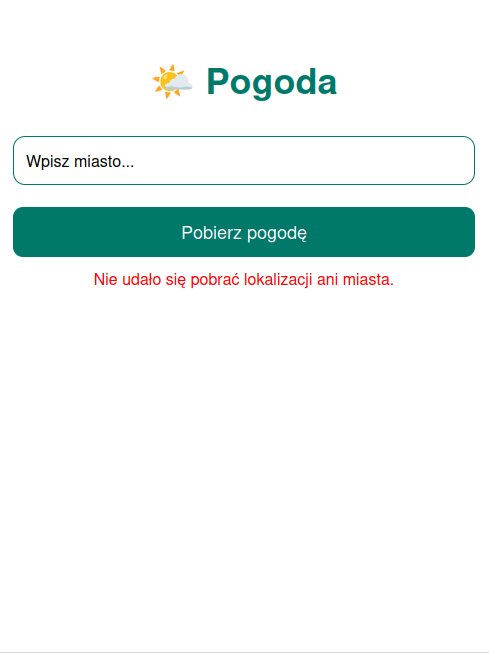
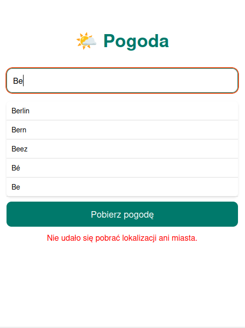
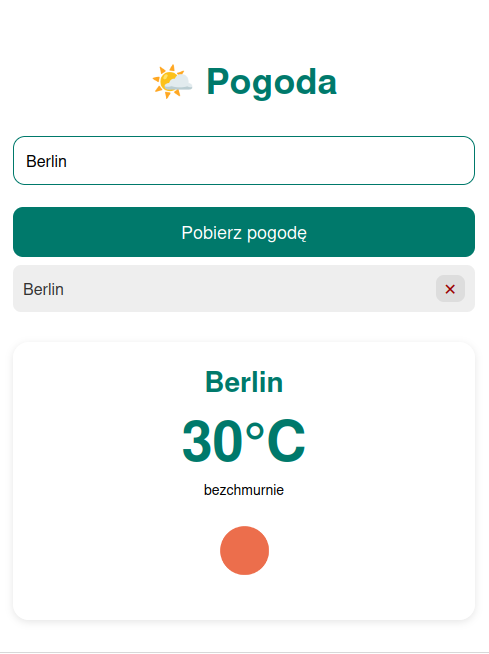
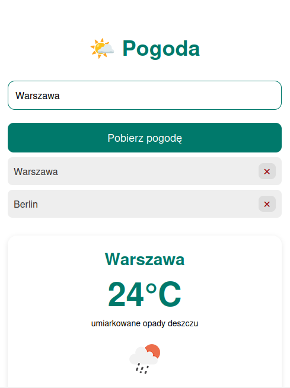
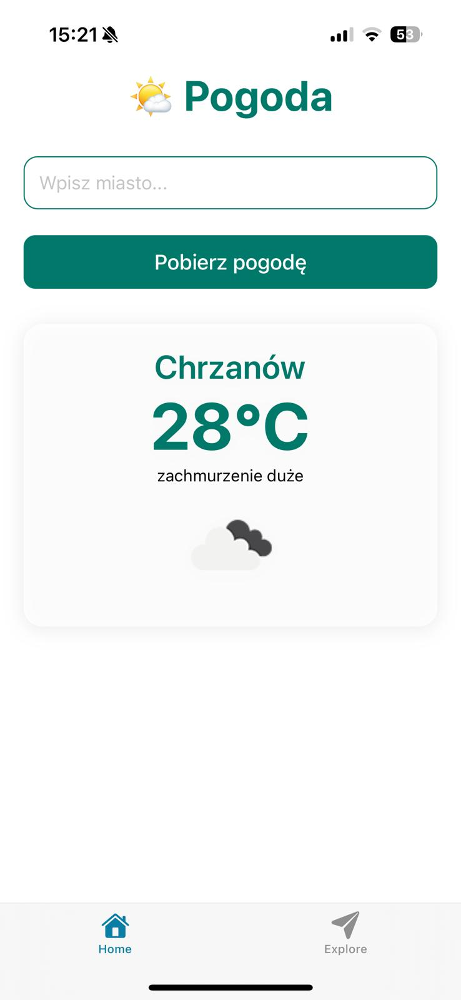
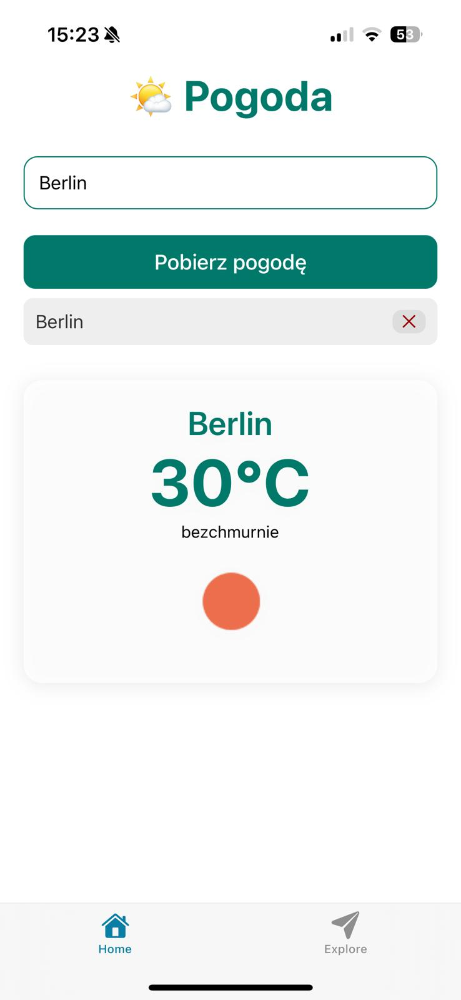
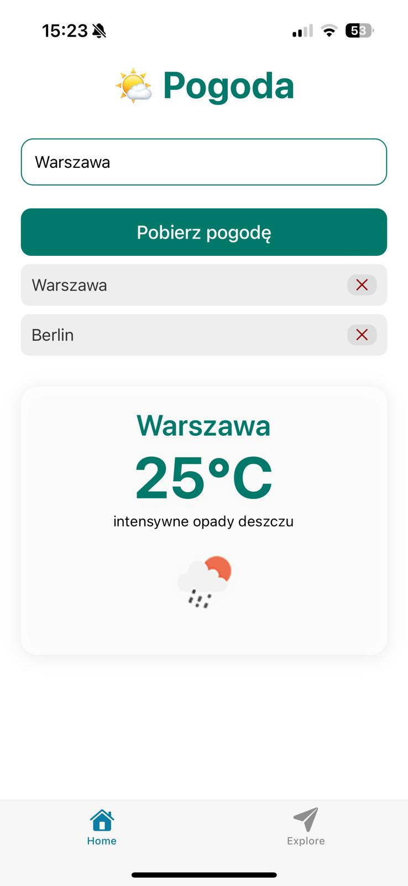

🌤️ **Aplikacja Pogodowa (Weather App)**

Aplikacja pogodowa stworzona w React Native. Umożliwia użytkownikowi sprawdzenie pogody w dowolnym mieście na podstawie jego nazwy lub bieżącej lokalizacji. Aplikacja korzysta z OpenWeatherMap API do pobierania danych pogodowych.

🚀 Funkcje

    🔍 Wyszukiwanie pogody po nazwie miasta.

    📍 Bieżąca lokalizacja – pobierz pogodę na podstawie swojej lokalizacji.

    📝 Historia wyszukiwań – zapisuj ostatnio wyszukane miasta lokalnie.

    💡 Autouzupełnianie – sugestie miast podczas wprowadzania tekstu.

    🌡️ Podstawowe dane pogodowe – temperatura, opis pogody, ikona stanu pogodowego.

---

🛠️ Technologie

    React Native – do tworzenia aplikacji mobilnych.

    Expo Location API – do uzyskiwania lokalizacji użytkownika.

    AsyncStorage – do przechowywania historii wyszukiwań.

    OpenWeatherMap API – do pobierania danych pogodowych.

    Debounce – do optymalizacji wyszukiwania miast.


---

## 📸 Screenshots

### 🌐 Web

   

### 📱 iOS (Expo Go)
   


---

## 🚀 Uruchomienie lokalne

1. Sklonuj repozytorium:
```
git clone https://github.com/kstarzyckababik/weather-app-react-native.git
cd todo-app-react-native  
npm install  
npm start
```

2. Otwórz w: Expo Go (skanując kod QR) / Emulatorze / Przeglądarce (w → Web Preview)
